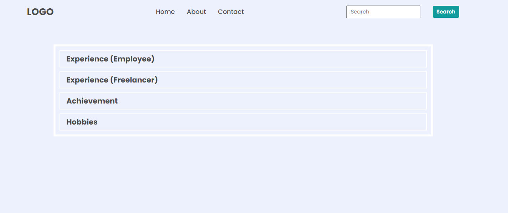

# Take 1
## Original Page

## Achieve the following with DOM manipulation

## javaScript code
```
'use strict';
let ulList = document.querySelector('ul');
console.log(ulList);
let listInside = ulList.getElementsByTagName('li');
console.log(listInside);
listInside[2].textContent = "Projects"
for(let i = 0;i<accordian.length;i++){
  let elementHeading = accordian[i];
  elementHeading.style.backgroundColor = '#dadaf8';
}
for(let i = 2 ; i<accordian.length;i++){
  let nextElement = accordian[i].nextElementSibling
  nextElement.style.display = 'block';
}
```