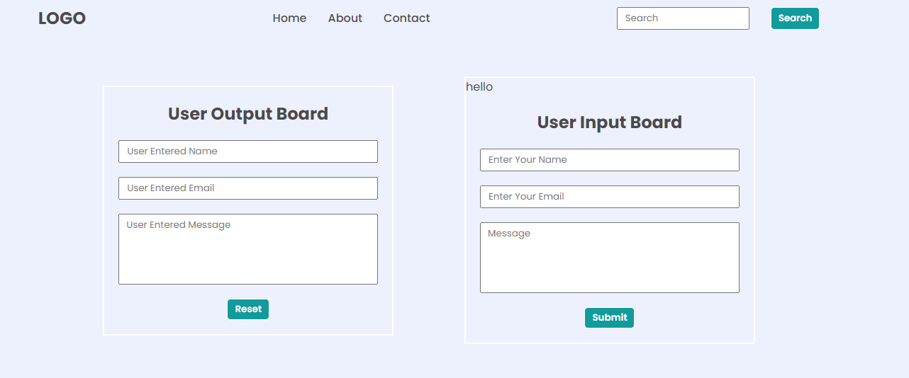

# Task 1
## Original Page

## Achieve the following with DOM manipulation

## JavaScript
```js
let leftInputField = document.querySelector('.mainLeftDetails')
console.log(leftInputField[0]);
leftInputField[0].value = "FSJS 2.0"
leftInputField[1].value = "fsjs@ineuron.ai"
leftInputField[2].value = "Hello World"

let rightDiv = document.querySelector('.mainRight')
let rightHeading = rightDiv.firstElementChild;
let rightInputFiled = rightHeading.nextElementSibling;
rightInputFiled[0].value = "FSJS 2.0";
rightInputFiled[1].value = "fsjs@ineuron.ai";
rightInputFiled[2].value = "Hello World";
```