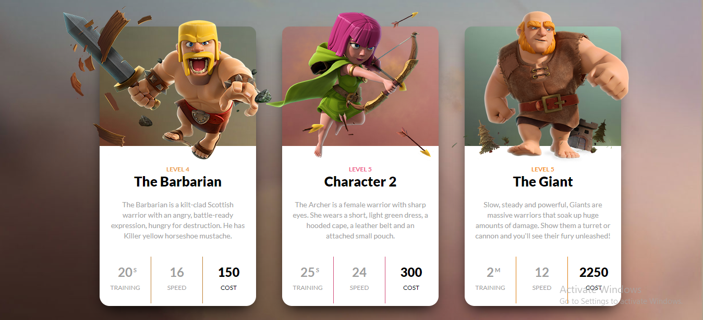
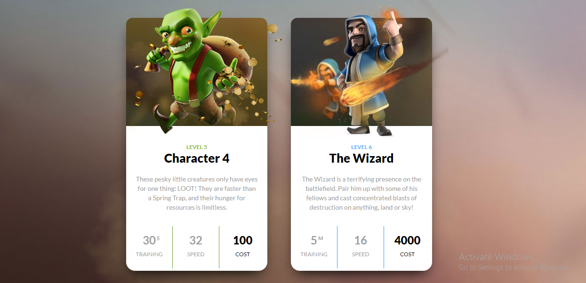

# Task
## Original Page


## Achieve the following with DOM manipulation

## JavaScript code to achieve the required output
```js
"use strict";

const callOneThird = function(myOneThird){
//  console.log(myOneThird);
for(let i = 0; i<myOneThird.length;i++){
        myOneThird[i].style.color = "#fff";
    }
}

const clearfixAll = document.querySelectorAll('.clearfix')
console.log(clearfixAll);
for(let i = 0; i<clearfixAll.length;i++){
    if(i === 0){
        clearfixAll[i].style.backgroundColor = "#ec9b3b"
       const oneThird = clearfixAll[i].querySelectorAll('.one-third');
       callOneThird(oneThird);
    }
    else if(i === 1){
        clearfixAll[i].style.backgroundColor = "#ee5487";
        const oneThird = clearfixAll[i].querySelectorAll('.one-third');
        callOneThird(oneThird);
    }
    else if( i === 2){
        clearfixAll[i].style.backgroundColor = "#f6901a";
        const oneThird = clearfixAll[i].querySelectorAll('.one-third');
        callOneThird(oneThird);
    }
    else if( i === 3){
        clearfixAll[i].style.backgroundColor = "#82bb30";
        const oneThird = clearfixAll[i].querySelectorAll('.one-third');
        callOneThird(oneThird);
    }
    else if( i === 4){
        clearfixAll[i].style.backgroundColor = "#4facff";
        const oneThird = clearfixAll[i].querySelectorAll('.one-third');
        callOneThird(oneThird);
    }
}
```