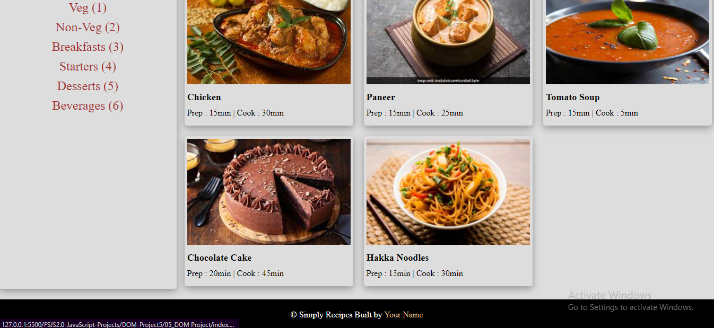

# Task
## Original Page


## Achieve the following with DOM manipulation

## JavaScript code to achive the required output
```js
"use strict";

//Recipes list
const tagCont = document.querySelector('.tags-container')
const tagContNext = tagCont.firstElementChild.nextElementSibling;
console.log(tagContNext);
const aElement = document.createElement('a')
aElement.innerText = "Chinese(7)"
aElement.href = "#"
tagContNext.appendChild(aElement)

// Navbar button
const proBTN = document.querySelector('.nav-center');
const lastChild = proBTN.lastElementChild;
const btnHref = document.createElement('a');
btnHref.innerText = "Pro Subscription";
btnHref.href = "#"
btnHref.classList.add('btn')
lastChild.appendChild(btnHref);

//6th card
const recipeGallery = document.querySelector('.recipe-gallery');
console.log(recipeGallery);
const sixthElementRecipe = document.createElement("div");
sixthElementRecipe.classList.add('card');
recipeGallery.appendChild(sixthElementRecipe);

// a tag inside div
const aTagSixthElement = document.createElement('a')
aTagSixthElement.setAttribute("href","#");
aTagSixthElement.classList.add("recipe-text");
sixthElementRecipe.appendChild(aTagSixthElement);

// creating element inside a tag
const element = ["img","h5","p"];
const elementCreated = [];
for(let i = 0; i<element.length;i++){
    elementCreated[i] = document.createElement(element[i]);
}
elementCreated[0].classList.add('recipe-img')
elementCreated[0].src = "./img/recipe-6.jpg"

elementCreated[1].classList.add("recipe-name");
elementCreated[1].innerText = "Chinese Noodles";

elementCreated[2].classList.add("recipe-disp");
elementCreated[2].innerText = "Prep : 20min | Cook : 45min";

for(let i = 0 ; i<elementCreated.length;i++){
    aTagSixthElement.appendChild(elementCreated[i]);
}
console.log(elementCreated);
console.log(recipeGallery.lastElementChild);

// My Name
const myName = document.querySelector(".page-footer");
const myNameOne = myName.firstElementChild.lastElementChild;
myNameOne.innerText = "Pritam Chauhan";
```