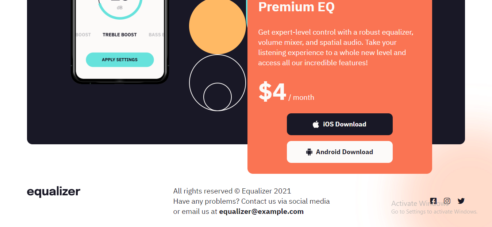

# Task 1
## Original Page


## Achieve the following with DOM manipulation


## JavaScript code to achive the required output
```js
"use strict";
// Ineuron Logo
const topImage = document.querySelector(".top_img")
const nextTopImage = topImage.nextElementSibling.firstElementChild;
nextTopImage.src = "./assets/ineuron-logo.png";

// Price
const appPrice = document.querySelector(".app_price");
appPrice.firstElementChild.innerText = "$10";

//Linkedin logo
const catchFooter = document.querySelector(".footer_social");
const divElem = document.createElement("div");
divElem.classList.add("footer_social_ico");
divElem.innerHTML = `<i class="fa-brands fa-linkedin">`;
catchFooter.appendChild(divElem);
console.log(catchFooter);
```