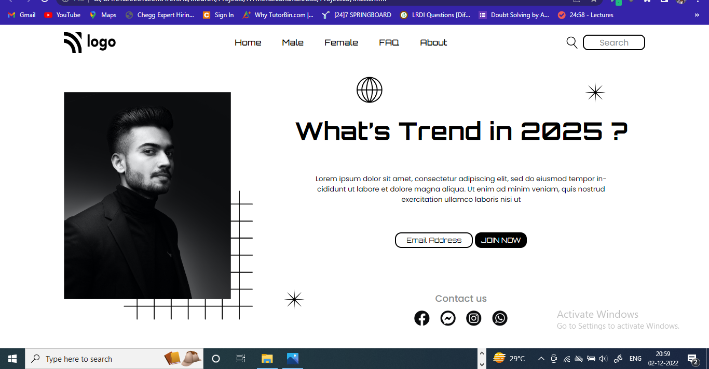

# LANDING PAGE 03-FSJS-2.0

The project that I have uploaded in this repository is a landing Page which is given to us as an assignment by mentors of Full Stack Javascript Developer Bootcamp 2.0. It is a static page which is made using basic concepts of Web-development.

## Tech Stack

**Web-development skills:** HTML and CSS.

**Source code editor:** VS Code

**Version control system**: Git and Github.

## Project Description
The project is static landing page. In this project I have used basic HTML elements and CSS properties. I will keep updating this project to make it look even more responsive to small scrren size as well. 

## Expected Output

## Result I got

## 🔗 Links
Links to contact me

## 🚀 About Me
I'm a student at ineuron.ai. I have enrolled in the FSJS 2.0 Bootcamp at ineuron for learning full stack javascript development.

## 😊 Small message from the creator.
Follow my github profile to be part of my journey to become full stack developer. Thank you for reading.